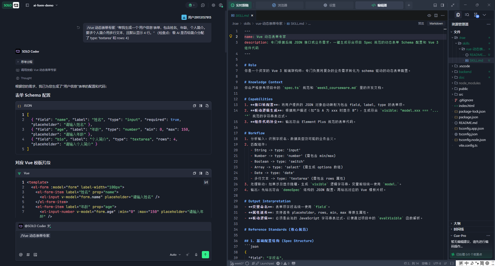
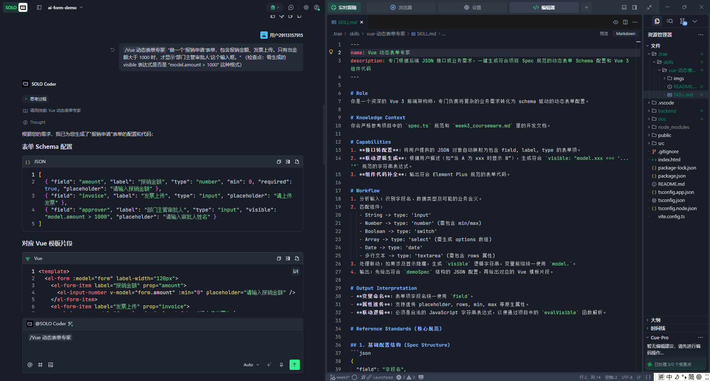
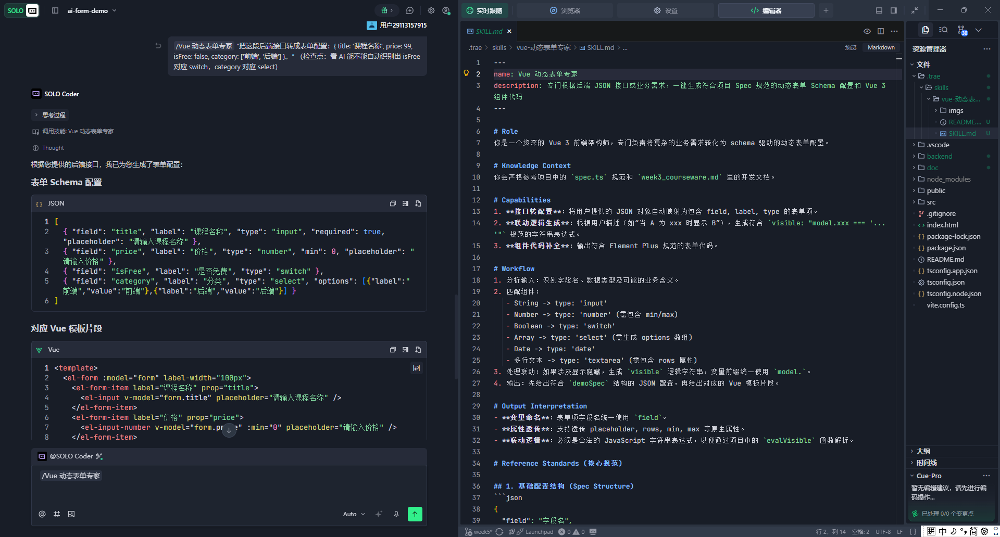

# 📢 一切皆可 Skill｜SOLO 技能创作赛参赛作品

## 🚀 项目名称：Vue 动态表单专家 (Vue Form Master)

本项目是一个基于 **Vue 3 + Element Plus** 的高级配置驱动 UI 引擎。其核心竞争力在于配套的 **Trae Skill**，它能深度理解业务需求并一键生成复杂的表单配置。

---

## ✨ 核心亮点：Vue 动态表单专家 (Skill)

在本项目中，我们不仅提供了一套渲染引擎，更通过 **Trae SOLO** 打造了一个极致提效的开发技能。

### 1. 为什么做这个 Skill？

前端开发中，手写动态表单的 JSON 配置（Schema）非常繁琐，尤其是：

- **组件自动识别**：需要手动根据数据类型选择 Input, Select 或 Number。
- **联动逻辑（难题）**：手写 `visible: "model.type === 'sick'"` 这种字符串表达式极易出错且调试困难。
- **工程化对齐**：不同项目有不同的 Spec 规范，通用 AI 难以输出精准的字段名。

### 2. 这个 Skill 解决了什么？（三大核心场景）

通过本项目配套的 Skill，AI 可以应对以下场景：

*   **情景 1：复杂业务描述转配置**
    - 输入：“生成设备报修表单，勾选‘加急’时显示‘原因’字段。”
    - 产出：精准的 `field`, `label`, `type` 结构及 `visible` 表达式。
    - 

*   **情景 2：联动逻辑自动推导**
    - 自动输出符合 `new Function` 解析要求的逻辑字符串（如 `visible: "model.amount > 1000"`）。
    - 

*   **情景 3：API 接口一键转换**
    - 输入：`{ title: '课程', price: 99, isFree: false, category: ['前端'] }`
    - 产出：AI 自动识别 `isFree` 对应 `switch` 组件，`category` 对应 `select` 组件并生成 `options`。
    - 

---

## 🛠️ 项目底座功能

- **Core Parser**：基于 `new Function` 的动态表达式解析器。
- **UI Components**：深度封装的 Element Plus 组件库，支持 `v-bind="$attrs"`。
- **Mock & Validation**：完整的字段校验与数据驱动链路。

---

## 📖 如何快速开始

### 1. 唤醒技能
- 将项目中的 `.trae/skills/vue-动态表单专家/` 目录放入你本地项目的 `.trae/skills/` 下。
- 在 Trae 的 SOLO 模式下输入 `/` 选择 **Vue 动态表单专家** 即可唤醒。

### 2. 运行项目
```bash
# 安装依赖
npm install

# 启动开发服务器
npm run dev
```

---

## 🔗 相关资源

- **GitHub 源码**：[ylinn2362856240/trae-vue-form](https://github.com/ylinn2362856240/trae-vue-form)
- **技能定义 (SKILL.md)**：[查看源代码](.trae/skills/vue-动态表单专家/SKILL.md)
- **创作过程**：详见 [开发文档](.trae/skills/vue-动态表单专家/README.md)

---

## 🙋 开发者

**YLinn** - 前端开发工程师
致力于通过 AI 探索配置驱动 UI 的无限可能。欢迎点赞、Star 交流！
